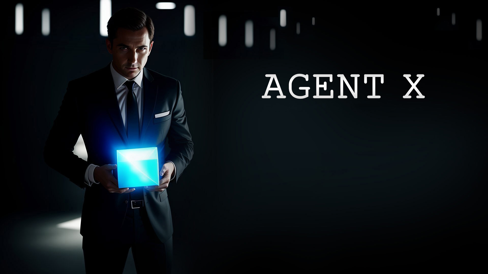

# Agent X: Unigine OpenAir 2023 Project
# Приложение к докладу на [Unigine OpenAir 2023](https://openair-2023.unigine.com/)

 
 
Видео тизер: https://youtu.be/WFsqbSRuhwI 
Видео геймплея: https://youtu.be/_Itraj5hwNg

# Инструкция по запуску
1. Скачиваем и устанавливаем Unigine SDK Browser 2 [вот отсюда](https://unigine.com/get-unigine/)
2. Устанавливаем Unigine SDK Community (2.16.1)
3. Создаем новый C# проект со следующими параметрами:
- Project Name: openair2023_agent
- SDK: UNIGINE 2 Community (2.16.1)
- Engine: Development
- Template: Empty
- API + IDE: C# (.NET)
- Precision: Float
4. Копируем содержимое текущего git репозитория в созданный проект с заменой файлов
5. Открываем редактор (кликая по кнопке "Open Editor")
6. Открываем мир worlds/main_menu.world
7. Нажимаем Play (зеленая стрелка по центру сверху)

# Полезные ссылки
1. (Ссылка на доклад будет позже)

